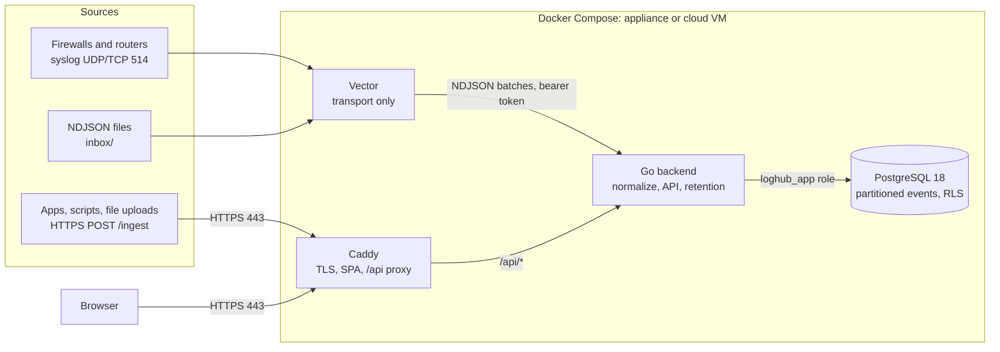

# Architecture

loghub is a demo multi-tenant log management system. Events arrive from syslog, HTTP and files, get normalized to one schema and stored in a PostgreSQL database, and are served to a React UI.
## Components

| Component | Role | Why |
|---|---|---|
| Caddy | The only public HTTP entry point. Terminates TLS, serves the SPA, proxies `/api/*`. | [ADR 0005](adr/0005-caddy-edge.md) |
| Vector | Receives syslog and inbox files, buffers on disk, forwards NDJSON to the backend. | [ADR 0004](adr/0004-vector-transport-only.md) |
| Backend (Go) | Parses and normalizes events, stores them, serves the API, runs retention. | [ADR 0001](adr/0001-go-backend.md) |
| PostgreSQL | Event store with daily partitions and row-level security. | [ADR 0002](adr/0002-postgres-event-store.md), [ADR 0003](adr/0003-tenant-isolation-rls.md) |
| Frontend | React SPA, built into the Caddy image. | [ADR 0006](adr/0006-react-vite-frontend.md) |

The API contract is `api/openapi.yaml`. Go handlers and TypeScript types are generated from it ([ADR 0007](adr/0007-openapi-spec-first.md)), and fixed database queries are generated by sqlc ([ADR 0008](adr/0008-sqlc-queries.md)).
