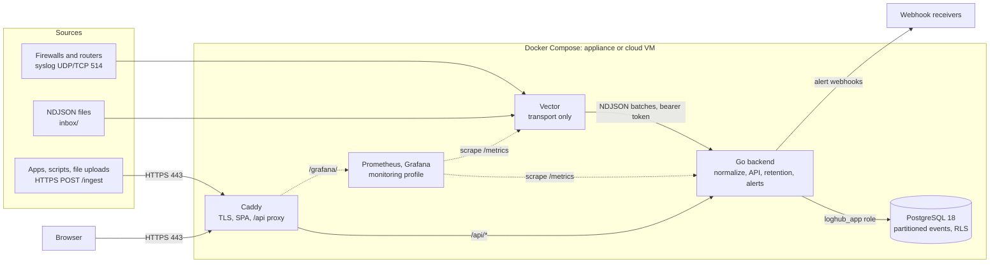
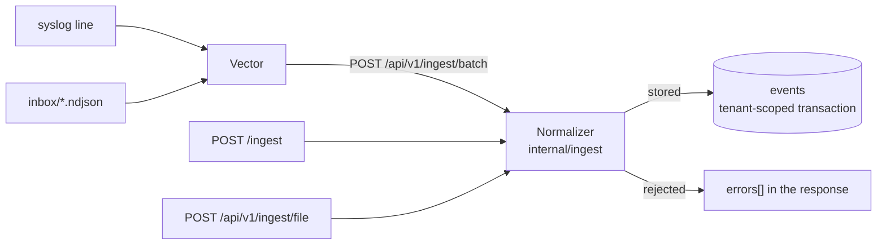

# Architecture

loghub is a demo multi-tenant log management system. Events arrive from syslog, HTTP and files, get normalized to one schema and stored in a PostgreSQL database, and are served to a React UI.

## Components



| Component | Role | Why |
|---|---|---|
| Caddy | The only public HTTP entry point. Terminates TLS, serves the SPA, proxies `/api/*`. | [ADR 0005](adr/0005-caddy-edge.md) |
| Vector | Receives syslog, reads and deletes files dropped in the inbox, buffers on disk, forwards NDJSON to the backend. | [ADR 0004](adr/0004-vector-transport-only.md) |
| Backend (Go) | Parses and normalizes events, stores them, serves the API, runs retention and evaluates alert rules. | [ADR 0001](adr/0001-go-backend.md), [ADR 0010](adr/0010-alerting.md) |
| PostgreSQL | Event store with daily partitions and row-level security. | [ADR 0002](adr/0002-postgres-event-store.md), [ADR 0003](adr/0003-tenant-isolation-rls.md) |
| Frontend | React SPA, built into the Caddy image. | [ADR 0006](adr/0006-react-vite-frontend.md) |
| Prometheus, Grafana | Optional, in the `monitoring` profile. Prometheus scrapes the backend's and Vector's metrics, and Grafana charts them at `/grafana/`. | [ADR 0012](adr/0012-metrics-prometheus.md) |

The API contract is `api/openapi.yaml`. Go handlers and TypeScript types are generated from it ([ADR 0007](adr/0007-openapi-spec-first.md)), and fixed database queries are generated by sqlc ([ADR 0008](adr/0008-sqlc-queries.md)).

## Data flow



Every path hands the normalizer one JSON object per event. Vector wraps a syslog line as `{"tenant": "...", "message": "<line>"}` and adds its receipt metadata. It forwards inbox lines byte for byte, and the HTTP paths pass the sender's JSON through unchanged too. A batch always answers 200 with accepted and rejected counts, because Vector retries a 5xx until it succeeds and drops the whole batch on most 4xx: failing a batch over one bad line would either stall the collector or lose every good record with it. Vector never reads the counts, so the backend also logs each request that had rejections. [`ingest/README.md`](../ingest/README.md) covers sending to the collector.

The handlers are in `backend/internal/api`. A record may be at most 1 MiB, and an NDJSON body at most 32 MiB. The body is read one line at a time, but every normalized event is held until the single insert at the end, so the body limit also bounds what one request holds in memory.

### Normalization

A record is rejected only when it can't be stored: it isn't a JSON object, or its tenant or source is missing or unknown. A field whose value can't be normalized is left empty, and the event is tagged `invalid:<field>`. The same happens to text longer than 2048 bytes, which Postgres can't index. The original is always kept in `raw`. NUL characters and invalid UTF-8, which Postgres can't store at all, are replaced with U+FFFD everywhere, `raw` included.

**Syslog lines** are records with a `message` whose source is absent, `firewall` or `network`.
- The header may be RFC 5424, which `logger` sends by default, or RFC 3164. It gives host, process and severity; syslog's 0–7 scale is mapped onto 0–10. Only an RFC 5424 timestamp is used, because RFC 3164 has no year or zone.
- The body is read as key=value pairs, and values may contain spaces. `src`, `dst`, `spt`, `dpt`, `proto`, `policy`, `event` and `reason` become `src_ip`, `dst_ip`, `src_port`, `dst_port`, `protocol`, `rule_name`, `event_type` and `event_subtype`. Keys already named like a schema field map directly.
- Without a source, a line with firewall keys is `firewall`, and anything else is `network`.
- `raw` is `{"message": "<line>"}`.

**JSON records** map fields named like the schema directly. `ip` means `src_ip`, and a nested `cloud` object is flattened. `raw` is the sender's `raw` object if there is one, and otherwise the whole record.

**Per source**, fields the record leaves empty are filled in:

| Source | Vendor / product | Also |
|---|---|---|
| ad | microsoft / windows | Event 4624 or 4625 is a login, and 4634 or 4647 a logout. `logon_type` becomes `event_subtype`, e.g. 3 → `network`. |
| m365 | microsoft / m365 | `UserLoggedIn` and `UserLoginFailed` are logins; a `status` field overrides the outcome. |
| aws | aws / cloudtrail | `event_type` comes from `raw.eventName`. `Create*` and `Delete*` become actions `create` and `delete`. `ConsoleLogin` is a login. |
| crowdstrike | crowdstrike / falcon | |
| api | | Event names with login, logon or sign-in are logins, and ones that also contain "fail" are failures. Logout and sign-out are logouts. |
| firewall | from the line | `event_type` defaults to `traffic`. |
| network | from the line | `event_type` defaults to `syslog`. |

**For every source:**
- `action` is lowercased, and synonyms are folded: block, drop and reject become `deny`; permit and accept become `allow`.
- A login sets `action` to `login` and adds the tag `auth_success` or `auth_failure`. The failed-login alert rule matches on that tag, so it works whatever a vendor calls the event.

**Time** is taken from `@timestamp`, then the RFC 5424 header, then the receipt time. A time older than the retention window, or more than an hour ahead, is replaced with the receipt time and tagged `rebased:timestamp`. Without this, sample data from 2025 would be purged on arrival and never appear in a search.

The rules live in `backend/internal/ingest`, and every event in `samples/json` and `samples/syslog` is one of its test cases.

### Storage

All events from one request are stored in one transaction. If the database fails, nothing is stored, the request answers 5xx, and Vector retries it.
- An event whose tenant the caller may not write to is rejected with `tenant_not_permitted` before the insert. No caller that may ingest today is limited to some tenants, so this check only fires once a policy limits an ingesting caller to some tenants.
- An event whose tenant doesn't exist is rejected with `unknown_tenant`.
- Events are inserted one tenant at a time, with that tenant set as the transaction's row-level security context ([ADR 0003](adr/0003-tenant-isolation-rls.md)). A row for any other tenant would fail the policy check.
- Inserts go to Postgres in batches of 1000, one round trip each. `COPY` would be faster, but Postgres doesn't allow it on a table with row-level security.
- If Postgres refuses a value anyway, the batch is rolled back to a savepoint and retried one event at a time. Only the refused event is rejected, with `unstorable_event`; failing the whole batch would make Vector retry it forever. The normalizer is meant to make this impossible, so the tests store every sample and a set of hostile records and expect no rejections.

### Retention

Events are kept for 7 days. `serve` calls `loghub_maintain_partitions` when it starts and then every hour ([ADR 0002](adr/0002-postgres-event-store.md)), from the job runner in `backend/internal/jobs`.
- Each call creates the daily partitions (UTC dates) from 7 days back to 2 days ahead. If maintenance hasn't run for more than 2 days, events for a day without a partition land in DEFAULT, and they move into that day's partition when it is created.
- A day's partition is dropped once the whole day is more than 7 days old, so an event is kept for between 7 and 8 days. Expired rows in DEFAULT are deleted.
- A failed call is logged and retried an hour later. Partitions exist 2 days ahead, so new events keep landing in their own partition through at least 2 days of failed runs.

### Search

`GET /api/v1/events` runs a single query, built at request time in `backend/internal/store/search.go` ([ADR 0008](adr/0008-sqlc-queries.md)). Every filter value is a bind parameter.
- **Scope:** the policy set decides which tenants the caller may read, and a `tenant` outside them is refused with 403 `tenant_not_permitted`. The query then runs in a transaction whose row-level security context is the caller. A viewer's search is also given their tenant as an explicit filter. That changes nothing about what they can see, but it lets Postgres use the `(tenant_id, ts)` index, which it can't do for the security policy's OR condition.
- **Window:** the time window picks the daily partitions to read. It defaults to the last 24 hours, and reaches an hour into the future, because the normalizer accepts event times up to an hour ahead.
- **Free text:** `q` matches any string or number value in `raw`, ignoring case. When the text contains nothing JSON would escape, a match against `raw`'s text form discards most rows first.
- **Paging:** pages are ordered by `(ts, id)` and resume after the last row of the previous page, so events that arrive in between don't shift them. The cursor also carries the time window and a hash of the other filters, so a cursor reused with different filters is rejected.
- **Timeout:** a search still running after 10 seconds is cancelled.

With a million events loaded, about 95,000 per tenant in a 24-hour window, a tenant's newest page takes under a millisecond, all tenants about 35 ms, and a free-text search 300–400 ms.

The code is `EventRepo` in `backend/internal/store`. `make test-db` runs its tests against the dev Postgres, as the `loghub_app` role, so they exercise the real policies.

### Dashboard counts

`GET /api/v1/events/top` and `GET /api/v1/events/timeline` count the events a search with the same filters would return. They reuse search's filter code in `backend/internal/store` rather than sqlc ([ADR 0008](adr/0008-sqlc-queries.md)), so a filter means the same thing in a chart and in the search beside it. Scope, the default window and the 10-second timeout are also search's.
- **Top values:** events are counted by `src_ip`, `dst_ip`, `user`, `host` or `event_type`, and the 10 most frequent values are returned, or up to 100. Events without a value aren't counted. Values with equal counts are in byte order, so the answer doesn't depend on the database's locale.
- **Timeline:** events are counted in buckets from 1 minute to 1 day wide. Buckets start on whole multiples of the interval in UTC, so they line up the same way whatever the window, and empty buckets are filled in so a chart has no gaps. Without an interval, the shortest that divides the window into at most 200 parts is used: 1 minute for an hour, 15 minutes for a day, an hour for a week. A window more than 1440 intervals long is refused, which still lets a day be counted by the minute. The limit is on the window's length rather than the number of buckets, because a window that doesn't start on a bucket boundary overlaps one more bucket than it has intervals.

With a million events spread over 24 hours, 100,000 per tenant, either count takes 50–70 ms for one tenant, 200–300 ms for all tenants, and about 350 ms with free text. Unlike a search, which stops at a page, a count reads every matching event in the window.

## Tenant model

A tenant is one customer's data, such as demoA, demoB and demoC in the demo. All tenants share one database, one set of tables and one set of services. Every row of tenant data carries a `tenant_id`, and PostgreSQL row-level security decides which of those rows a transaction may read or write ([ADR 0003](adr/0003-tenant-isolation-rls.md)).

### What belongs to a tenant

| Table | Tenant | Row-level security |
|---|---|---|
| `tenants` | its `id`: 1 to 64 letters, digits, `-` or `_` | none. It is read before there is a tenant to scope by, and holds only IDs and names. |
| `users` | a viewer's one tenant. An admin has none, which a `CHECK` enforces. | none. It is read to find out who is calling, and `loghub_app` can only select from it. |
| `events` | `tenant_id`, required | the tenant policy |
| `alert_rules` | `tenant_id`, required | the tenant policy |
| `alerts` | `tenant_id`, required. Its foreign key is the rule's ID and tenant together, so an alert is always in its rule's tenant. | the tenant policy |

There is no API for tenants or users. `loghub seed` creates demoA, demoB and demoC, a viewer for each and the admin, and the `seed` service runs it on every `make up`, leaving existing rows alone.

### Where the tenant comes from

When events are written, the tenant is part of each event:

| Path | Tenant |
|---|---|
| Syslog, UDP or TCP 514 | `SYSLOG_DEFAULT_TENANT` in `.env`, demoA by default, for every sender. Vector adds it to each line. |
| `POST /ingest`, the batch endpoint and `inbox/` files | the record's `tenant` |
| `POST /api/v1/ingest/file` and the UI's Upload page | the record's `tenant`, or the `tenant` query parameter for records without one |

The ingest key and an admin's token may write to any tenant, and a viewer's token to none. A tenant that doesn't exist is rejected with `unknown_tenant`.

When data is read, the tenant comes from the caller's token, never from the request. A viewer's token carries their tenant, and an admin's carries none. A `tenant` query parameter narrows what the caller may read and never widens it: a viewer who names another tenant gets 403 `tenant_not_permitted`.

### How it is enforced

There are two layers, and either one alone keeps a viewer out of another tenant's data:

1. **Policies:** each handler asks the enforcer whether the caller may act on a tenant's resource, or which tenants a list may include. [Authentication and authorization](#authentication-and-authorization) has the rules.
2. **Row-level security:** every query runs in a transaction that first sets `app.tenant_id` and `app.is_admin` with `set_config(..., true)`, through `Store.InScope` in `backend/internal/store`. `events`, `alert_rules` and `alerts` have the same policy, for reads and writes:

   ```sql
   tenant_id = current_setting('app.tenant_id', true) OR current_setting('app.is_admin', true) = 'on'
   ```

The backend connects as `loghub_app`, which doesn't own the tables, so the policy always applies to it. Only the one-shot `migrate` and `seed` services connect as the owner. The settings are transaction-local, so a pooled connection can't carry one request's tenant into the next, and a query outside a scoped transaction matches no rows at all.

The row-level security context comes from the caller or from the data, never from a policy's answer:

| Work | Context |
|---|---|
| Search, dashboard counts, rule and alert lists | the caller: a viewer's tenant, or every tenant for an admin |
| Ingest | each record's tenant in turn, so a row for any other tenant fails the policy's check |
| Alert evaluation | each tenant in turn, never every tenant at once |
| Retention | the owner, through `loghub_maintain_partitions`, which drops a whole day for every tenant at once |

### What tenants share

- One retention period of seven days, and one partition a day that holds every tenant's events.
- Indexes that start with `tenant_id`, so a search for one tenant reads only that tenant's entries. A viewer's search names their tenant explicitly as well, because Postgres can't use an index for the policy's `OR`.
- One ingest key, which may write to every tenant, and one tenant for every syslog sender.
- Capacity. There are no per-tenant limits, so one tenant's heavy searches or bursts of events slow the others down.

### Limits

- A user belongs to one tenant or, as an admin, to all of them. Access to some tenants but not others needs a membership table, and a policy that takes a set of tenants ([ADR 0009](adr/0009-auth-jwt-rbac.md)).
- Syslog senders aren't told apart. Mapping sender addresses to tenants is a change in the backend ([ADR 0004](adr/0004-vector-transport-only.md)).
- A schema or database per tenant would isolate tenants more strongly and allow retention per tenant. Every query already goes through the one scoped helper, which is where that change would start ([ADR 0003](adr/0003-tenant-isolation-rls.md)).

## Authentication and authorization

[ADR 0009](adr/0009-auth-jwt-rbac.md) has the reasoning. Before a request is routed, the middleware in `backend/internal/auth` establishes who is calling:

| Credential | Caller | Tenant |
|---|---|---|
| none | anonymous | none |
| `INGEST_TOKEN` from `.env`, compared in constant time | collector | none, writes any |
| a token from `POST /api/v1/auth/login` (HS256, 12 hours, signed with `AUTH_SECRET`) | the user's role, admin or viewer | a viewer's own |
| anything else | refused with 401 `invalid_token` | |

Each handler then asks the enforcer in `backend/internal/authz` whether the caller may act. The policies are in `backend/internal/api/policies.go`:

| Role | Health, sign-in | Tenants | Events | Alert rules | Alerts |
|---|---|---|---|---|---|
| anonymous | yes | no | no | no | no |
| admin | yes | list, all | read and create, any tenant | read and create, any tenant | read, any tenant |
| viewer | yes | list, own | read, own tenant | read, own tenant | read, own tenant |
| collector | yes | no | create, any tenant | no | no |

A refused anonymous caller gets 401 `authentication_required`, and a refused signed-in one gets 403. Search and the dashboard counts ask which tenants the caller may read, and ingest asks about each record's tenant. The row-level security context comes from the caller, not from a policy answer: a viewer's own tenant, or every tenant for an admin. A policy that is too generous about tenants therefore can't let a caller read rows outside that context. There are two exceptions. Ingest inserts as each record's tenant, so the per-record check is the only check on writes. `tenants` has no row-level security, since it is read before there is a tenant to scope by, so `GET /api/v1/tenants` narrows its list to the policy's answer itself. The list holds only IDs and names.

Sign-in checks an unknown email against a fixed bcrypt hash, so it takes as long as a wrong password, and both are refused with 401 `invalid_credentials`. Tokens can't be revoked before they expire.

Each client address may make 10 sign-in attempts a minute, right or wrong, and all 10 at once after a quiet minute. After that it gets one more every six seconds, and in between it is refused with 429 `too_many_attempts` and `Retry-After`, without the password being checked. The address is the one Caddy puts in `X-Forwarded-For`, which it overwrites rather than extends, since it trusts no proxy in front of it; the backend has no published port to reach it by any other way. An IPv6 address counts with the rest of its /64, the block one subscriber is usually given. The counts are token buckets in the backend's memory (`backend/internal/limiter`), so a restart forgets them, and a second backend replica would need a shared store behind the same `Backend` interface. There is no limit per account: an attacker could use it to lock the admin out, and a generated password is out of reach of guessing at 10 a minute from each address.

## Alerting

[ADR 0010](adr/0010-alerting.md) has the reasoning. A rule is a row in `alert_rules`: a tenant, an optional filter on `source`, `event_type`, `action`, `severity_min` and `tags`, a `group_by` of `src_ip`, `dst_ip`, `user` or `host`, a threshold, a window, a cooldown, and an optional webhook URL. [`samples/alert_rule.json`](../samples/alert_rule.json) is the failed-login example: five events tagged `auth_failure` from one `src_ip` within five minutes. The tag covers failed logins from every source that reports them, so the rule doesn't name vendor events.

- **Evaluation:** every minute, `serve` lists the tenants, reads each tenant's rules as that tenant, and evaluates each rule in its own transaction as that tenant too. Neither step runs as an admin. The code is in `backend/internal/alerting`. A rule becomes one statement, `AlertRepo.Evaluate` in `backend/internal/store`, which counts the window's matching events by group and inserts a row into `alerts` for each group that reaches the threshold. Events with no value for `group_by` aren't counted. A rule's query is cancelled after 30 seconds, and a rule that fails is logged and skipped.
- **Window:** it ends on the last whole minute at least 30 seconds ago. Events the collector delivers a little late are still counted, and every evaluation within one minute covers the same window. An alert appears up to about two and a half minutes after the event that completes it.
- **Repeats:** an alert is unique on rule, group and window start, so the same window is never recorded twice. After an alert, its group stays quiet until the rule's cooldown has passed since the end of that alert's window. The cooldown defaults to the window length, so one burst raises one alert, and a burst that keeps going raises one per window.
- **Delivery:** `GET /api/v1/alerts` lists alerts newest first, for the UI's alert page. When a rule has a webhook URL, each new alert is also POSTed to it as JSON, the same object the API lists. The request times out after 5 seconds and redirects aren't followed. A failed delivery is logged with the URL's host only, since the URL often holds a secret, and it isn't retried.
- **Access:** admins create and read rules for any tenant. A viewer reads their own tenant's rules and alerts, and sees rules without their webhook URLs. Rules can't be changed or removed through the API. Both tables have the same row-level security policy as `events`, and `loghub_app` may only select from them and insert into them.

## Metrics

[ADR 0012](adr/0012-metrics-prometheus.md) has the reasoning. The backend serves Prometheus metrics at `/metrics` on its own listener, `METRICS_ADDR` (`:9090`), and Vector serves its own on 9598. Neither port is published or routed by Caddy. In the `monitoring` profile, Prometheus scrapes both every 15 seconds and keeps 7 days, and Grafana shows the dashboard in [`monitoring/grafana/dashboards/loghub.json`](../monitoring/grafana/dashboards/loghub.json) at `/grafana/`, behind its own login.

| Metric | Type | Labels | Counted |
|---|---|---|---|
| `loghub_http_requests_total` | counter | `method`, `route`, `code` | when the API answers a request |
| `loghub_http_request_duration_seconds` | histogram | `method`, `route` | the same |
| `loghub_ingested_events_total` | counter | `tenant`, `source` | when a batch's events are stored |
| `loghub_rejected_records_total` | counter | `code` | when a batch is stored, for the records it rejected |
| `loghub_sign_ins_total` | counter | `outcome`: `signed_in`, `invalid_credentials`, `too_many_attempts` | when a sign-in reaches the password check |
| `loghub_alerts_raised_total` | counter | `tenant` | when a rule raises an alert |
| `loghub_alert_rule_evaluations_total` | counter | `outcome`: `ok`, `failed` | for each rule, every minute |
| `loghub_webhook_deliveries_total` | counter | `outcome`: `delivered`, `failed` | for each alert sent to a webhook |
| `loghub_job_runs_total` | counter | `job`, `outcome`: `ok`, `failed`, `panicked` | when a background job's run ends |
| `loghub_job_duration_seconds` | histogram | `job` | the same |
| `loghub_job_last_success_timestamp_seconds` | gauge | `job` | when a run ends without an error |
| `loghub_db_pool_*` | gauges and counters | none | read from the connection pool at each scrape |
| `go_*`, `process_*` | client_golang's own | | read from the runtime and `/proc` at each scrape |

- **Labels:** every label has a closed set of values, so no request can add a series. `route` is the ServeMux pattern the request matched, or `unmatched`, and it is looked up even when authentication refuses the request before routing. An unmatched request's method is kept only if it is a standard one. `tenant` and `source` come from stored events, whose tenant exists and whose source the normalizer knows. A rejected record counts only by its code.
- **What isn't counted:** a batch the database refuses as a whole counts nothing, since the collector sends it again. A job run stopped by shutdown doesn't count either.
- **Resets:** the counts live in the backend's memory, so a restart sets them to zero. Prometheus's `rate()` and `increase()` allow for that.
- **Vector:** `vector_component_received_events_total` by `component_id` shows syslog over UDP and TCP and inbox lines as they arrive, and `vector_buffer_events` shows what is waiting in the disk buffer for the backend.

## Edge and UI

### Edge

Caddy ([ADR 0005](adr/0005-caddy-edge.md)) is the only service with HTTP ports published beyond the host itself. Prometheus is published on `127.0.0.1:9090` only. Its configuration, [`frontend/Caddyfile`](../frontend/Caddyfile), is built into its image along with the UI.
- **Address:** Caddy answers to the one name or address in `SITE_ADDRESS`. `localhost` and private addresses get certificates from Caddy's own CA, and public names get them from Let's Encrypt. A client that connects by IP address sends no server name, so that address's certificate is the default. Any other host gets an empty response, and port 80 only redirects to HTTPS.
- **Routes:** `/api/*` goes to the backend unchanged, and `/ingest` is rewritten to `/api/v1/ingest`. `/grafana/` goes to Grafana, and Caddy answers 502 when the `monitoring` profile isn't running. Everything else is the UI. Files under `/assets/` have a content hash in their names and are cached for a year. Any other path gets `index.html`, which is never cached, so a new build shows on the next load.
- **Headers:** every response has `X-Content-Type-Options`, `X-Frame-Options` and `Referrer-Policy`. HSTS is added unless the site is `localhost`, where it would stick to every local port. The UI's pages also get a Content-Security-Policy that allows nothing but files and requests from their own origin: no inline scripts or styles, and no framing. The API reference at `/api/docs` loads Scalar from a CDN and runs an inline script, so it has no such policy.
- **Privileges:** Caddy runs as an unprivileged user, with only the capability to bind ports 80 and 443. Its certificates and CA are kept in the `caddy_data` volume.

### UI

`frontend/` is a React single-page app ([ADR 0006](adr/0006-react-vite-frontend.md)). It calls the API on its own origin through a client typed from the spec ([ADR 0007](adr/0007-openapi-spec-first.md)), and `make gen-api` regenerates those types in `frontend/src/api/schema.d.ts`.
- **Session:** the token from sign-in is kept in `sessionStorage` and sent as a bearer token. When it expires, or the API refuses it with 401, the UI drops it and everything it had fetched, and returns to sign-in. The UI's role checks only decide what to show. The API decides what is allowed.
- **Filters:** the dashboard and search keep the time range, tenant, sources and other filters in the URL, under the API's parameter names, so a link carries them between the two pages. A preset range such as the last 24 hours is worked out for each request and ends at the start of the next minute. Every count on a screen therefore covers the same window.
- **Freshness:** the UI polls. Counts refresh every 30 seconds. The first page of a search and the alerts refresh every 15 seconds. Nothing is pushed to the browser.
- **Tenants:** an admin chooses from `GET /api/v1/tenants`, and a viewer sees their own tenant's name. A link that names another tenant shows a notice instead of sending requests the API would refuse.
- **Loading:** each page is its own bundle, so the chart library loads only with the dashboard.

`make test` runs the UI's tests with Vitest against a fake API, and `make lint` type-checks, lints and format-checks it. `make dev-web` serves the UI with hot reload, and passes `/api` to the backend on `127.0.0.1:8080`.
