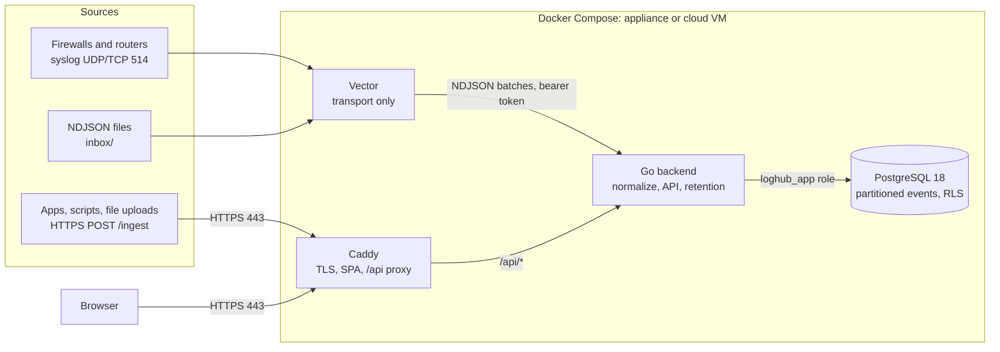
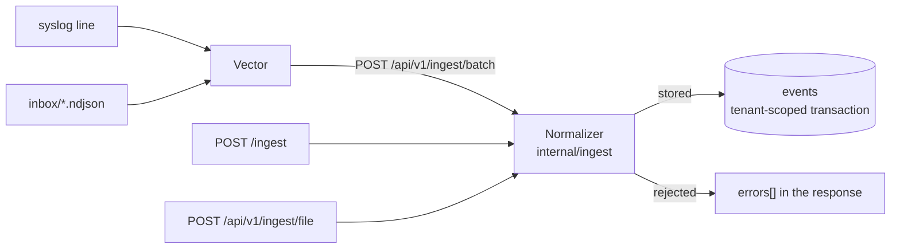

# Architecture

loghub is a demo multi-tenant log management system. Events arrive from syslog, HTTP and files, get normalized to one schema and stored in a PostgreSQL database, and are served to a React UI.

## Components

| Component | Role | Why |
|---|---|---|
| Caddy | The only public HTTP entry point. Terminates TLS, serves the SPA, proxies `/api/*`. | [ADR 0005](adr/0005-caddy-edge.md) |
| Vector | Receives syslog and inbox files, buffers on disk, forwards NDJSON to the backend. | [ADR 0004](adr/0004-vector-transport-only.md) |
| Backend (Go) | Parses and normalizes events, stores them, serves the API, runs retention. | [ADR 0001](adr/0001-go-backend.md) |
| PostgreSQL | Event store with daily partitions and row-level security. | [ADR 0002](adr/0002-postgres-event-store.md), [ADR 0003](adr/0003-tenant-isolation-rls.md) |
| Frontend | React SPA, built into the Caddy image. | [ADR 0006](adr/0006-react-vite-frontend.md) |

The API contract is `api/openapi.yaml`. Go handlers and TypeScript types are generated from it ([ADR 0007](adr/0007-openapi-spec-first.md)), and fixed database queries are generated by sqlc ([ADR 0008](adr/0008-sqlc-queries.md)).

## Data flow

Every path hands the normalizer one JSON object per event. Vector wraps a syslog line as `{"tenant": "...", "message": "<line>"}` and adds its receipt metadata. The HTTP paths pass the sender's JSON through unchanged. A batch always answers 200 with accepted and rejected counts, so one bad line never makes Vector retry the whole batch.

### Normalization

A record is rejected only when it can't be stored: it isn't a JSON object, or its tenant or source is missing or unknown. A field whose value can't be normalized is left empty, and the event is tagged `invalid:<field>`. The original is always kept in `raw`.

**Syslog lines** are records with a `message` whose source is absent, `firewall` or `network`.
- The header may be RFC 5424, which `logger` sends by default, or RFC 3164. It gives host, process and severity; syslog's 0–7 scale is mapped onto 0–10. Only an RFC 5424 timestamp is used, because RFC 3164 has no year or zone.
- The body is read as key=value pairs, and values may contain spaces. `src`, `dst`, `spt`, `dpt`, `proto`, `policy`, `event` and `reason` become `src_ip`, `dst_ip`, `src_port`, `dst_port`, `protocol`, `rule_name`, `event_type` and `event_subtype`. Keys already named like a schema field map directly.
- Without a source, a line with firewall keys is `firewall`, and anything else is `network`.
- `raw` is `{"message": "<line>"}`.

**JSON records** map fields named like the schema directly. `ip` means `src_ip`, and a nested `cloud` object is flattened. `raw` is the sender's `raw` object if there is one, and otherwise the whole record.

**Per source**, fields the record leaves empty are filled in:

| Source | Vendor / product | Also |
|---|---|---|
| ad | microsoft / windows | Event 4624 or 4625 is a login, and 4634 or 4647 a logout. `logon_type` becomes `event_subtype`, e.g. 3 → `network`. |
| m365 | microsoft / m365 | `UserLoggedIn` and `UserLoginFailed` are logins; a `status` field overrides the outcome. |
| aws | aws / cloudtrail | `event_type` comes from `raw.eventName`. `Create*` and `Delete*` become actions `create` and `delete`. `ConsoleLogin` is a login. |
| crowdstrike | crowdstrike / falcon | |
| api | | Event names with login, logon or sign-in are logins, and ones that also contain "fail" are failures. Logout and sign-out are logouts. |
| firewall | from the line | `event_type` defaults to `traffic`. |
| network | from the line | `event_type` defaults to `syslog`. |

**For every source:**
- `action` is lowercased, and synonyms are folded: block, drop and reject become `deny`; permit and accept become `allow`.
- A login sets `action` to `login` and adds the tag `auth_success` or `auth_failure`. The failed-login alert rule matches on that tag, so it works whatever a vendor calls the event.

**Time** is taken from `@timestamp`, then the RFC 5424 header, then the receipt time. A time older than the retention window, or more than an hour ahead, is replaced with the receipt time and tagged `rebased:timestamp`. Without this, sample data from 2025 would be purged on arrival and never appear in a search.

The rules live in `backend/internal/ingest`, and every file in `samples/` is one of its test cases.
