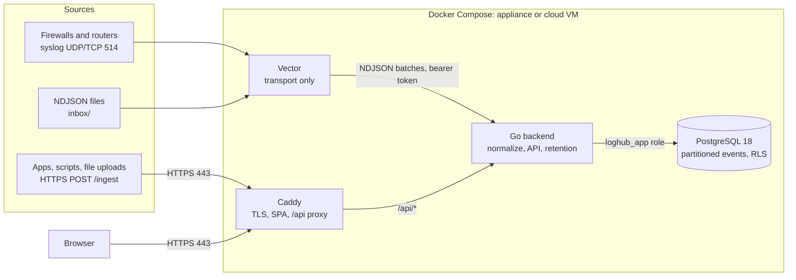
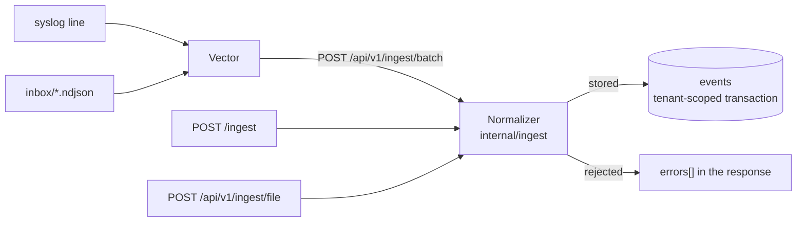

# Architecture

loghub is a demo multi-tenant log management system. Events arrive from syslog, HTTP and files, get normalized to one schema and stored in a PostgreSQL database, and are served to a React UI.

## Components

| Component | Role | Why |
|---|---|---|
| Caddy | The only public HTTP entry point. Terminates TLS, serves the SPA, proxies `/api/*`. | [ADR 0005](adr/0005-caddy-edge.md) |
| Vector | Receives syslog, reads and deletes files dropped in the inbox, buffers on disk, forwards NDJSON to the backend. | [ADR 0004](adr/0004-vector-transport-only.md) |
| Backend (Go) | Parses and normalizes events, stores them, serves the API, runs retention. | [ADR 0001](adr/0001-go-backend.md) |
| PostgreSQL | Event store with daily partitions and row-level security. | [ADR 0002](adr/0002-postgres-event-store.md), [ADR 0003](adr/0003-tenant-isolation-rls.md) |
| Frontend | React SPA, built into the Caddy image. | [ADR 0006](adr/0006-react-vite-frontend.md) |

The API contract is `api/openapi.yaml`. Go handlers and TypeScript types are generated from it ([ADR 0007](adr/0007-openapi-spec-first.md)), and fixed database queries are generated by sqlc ([ADR 0008](adr/0008-sqlc-queries.md)).

## Data flow

Every path hands the normalizer one JSON object per event. Vector wraps a syslog line as `{"tenant": "...", "message": "<line>"}` and adds its receipt metadata. It forwards inbox lines byte for byte, and the HTTP paths pass the sender's JSON through unchanged too. A batch always answers 200 with accepted and rejected counts, because Vector retries a 5xx until it succeeds and drops the whole batch on most 4xx: failing a batch over one bad line would either stall the collector or lose every good record with it. Vector never reads the counts, so the backend also logs each request that had rejections. [`ingest/README.md`](../ingest/README.md) covers sending to the collector.

The handlers are in `backend/internal/api`. A record may be at most 1 MiB, and an NDJSON body at most 32 MiB. The body is read one line at a time, but every normalized event is held until the single insert at the end, so the body limit also bounds what one request holds in memory.

### Normalization

A record is rejected only when it can't be stored: it isn't a JSON object, or its tenant or source is missing or unknown. A field whose value can't be normalized is left empty, and the event is tagged `invalid:<field>`. The same happens to text longer than 2048 bytes, which Postgres can't index. The original is always kept in `raw`. NUL characters and invalid UTF-8, which Postgres can't store at all, are replaced with U+FFFD everywhere, `raw` included.

**Syslog lines** are records with a `message` whose source is absent, `firewall` or `network`.
- The header may be RFC 5424, which `logger` sends by default, or RFC 3164. It gives host, process and severity; syslog's 0–7 scale is mapped onto 0–10. Only an RFC 5424 timestamp is used, because RFC 3164 has no year or zone.
- The body is read as key=value pairs, and values may contain spaces. `src`, `dst`, `spt`, `dpt`, `proto`, `policy`, `event` and `reason` become `src_ip`, `dst_ip`, `src_port`, `dst_port`, `protocol`, `rule_name`, `event_type` and `event_subtype`. Keys already named like a schema field map directly.
- Without a source, a line with firewall keys is `firewall`, and anything else is `network`.
- `raw` is `{"message": "<line>"}`.

**JSON records** map fields named like the schema directly. `ip` means `src_ip`, and a nested `cloud` object is flattened. `raw` is the sender's `raw` object if there is one, and otherwise the whole record.

**Per source**, fields the record leaves empty are filled in:

| Source | Vendor / product | Also |
|---|---|---|
| ad | microsoft / windows | Event 4624 or 4625 is a login, and 4634 or 4647 a logout. `logon_type` becomes `event_subtype`, e.g. 3 → `network`. |
| m365 | microsoft / m365 | `UserLoggedIn` and `UserLoginFailed` are logins; a `status` field overrides the outcome. |
| aws | aws / cloudtrail | `event_type` comes from `raw.eventName`. `Create*` and `Delete*` become actions `create` and `delete`. `ConsoleLogin` is a login. |
| crowdstrike | crowdstrike / falcon | |
| api | | Event names with login, logon or sign-in are logins, and ones that also contain "fail" are failures. Logout and sign-out are logouts. |
| firewall | from the line | `event_type` defaults to `traffic`. |
| network | from the line | `event_type` defaults to `syslog`. |

**For every source:**
- `action` is lowercased, and synonyms are folded: block, drop and reject become `deny`; permit and accept become `allow`.
- A login sets `action` to `login` and adds the tag `auth_success` or `auth_failure`. The failed-login alert rule matches on that tag, so it works whatever a vendor calls the event.

**Time** is taken from `@timestamp`, then the RFC 5424 header, then the receipt time. A time older than the retention window, or more than an hour ahead, is replaced with the receipt time and tagged `rebased:timestamp`. Without this, sample data from 2025 would be purged on arrival and never appear in a search.

The rules live in `backend/internal/ingest`, and every file in `samples/` is one of its test cases.

### Storage

All events from one request are stored in one transaction. If the database fails, nothing is stored, the request answers 5xx, and Vector retries it.
- An event whose tenant the caller may not write to is rejected with `tenant_not_permitted` before the insert. No caller that may ingest today is limited to some tenants, so this is only reached by a policy that grants one.
- An event whose tenant doesn't exist is rejected with `unknown_tenant`.
- Events are inserted one tenant at a time, with that tenant set as the transaction's row-level security context ([ADR 0003](adr/0003-tenant-isolation-rls.md)). A row for any other tenant would fail the policy check.
- Inserts go to Postgres in batches of 1000, one round trip each. `COPY` would be faster, but Postgres doesn't allow it on a table with row-level security.
- If Postgres refuses a value anyway, the batch is rolled back to a savepoint and retried one event at a time. Only the refused event is rejected, with `unstorable_event`; failing the whole batch would make Vector retry it forever. The normalizer is meant to make this impossible, so the tests store every sample and a set of hostile records and expect no rejections.

### Retention

Events are kept for 7 days. `serve` calls `loghub_maintain_partitions` when it starts and then every hour ([ADR 0002](adr/0002-postgres-event-store.md)), from the job runner in `backend/internal/jobs`.
- Each call creates the daily partitions (UTC dates) from 7 days back to 2 days ahead. If maintenance hasn't run for more than 2 days, events for a day without a partition land in DEFAULT, and they move into that day's partition when it is created.
- A day's partition is dropped once the whole day is more than 7 days old, so an event is kept for between 7 and 8 days. Expired rows in DEFAULT are deleted.
- A failed call is logged and retried an hour later. Partitions exist 2 days ahead, so new events keep landing in their own partition for many failed runs in a row.

### Search

`GET /api/v1/events` runs a single query, built at request time in `backend/internal/store/search.go` ([ADR 0008](adr/0008-sqlc-queries.md)). Every filter value is a bind parameter.
- **Scope:** the policy set decides which tenants the caller may read, and a `tenant` outside them is refused with 403 `tenant_not_permitted`. The query then runs in a transaction whose row-level security context is the caller. A viewer's search is also given their tenant as an explicit filter. That changes nothing about what they can see, but it lets Postgres use the `(tenant_id, ts)` index, which the security policy's OR condition can't.
- **Window:** the time window picks the daily partitions to read. It defaults to the last 24 hours, and reaches an hour into the future, because the normalizer accepts event times up to an hour ahead.
- **Free text:** `q` matches any string or number value in `raw`, ignoring case. When the text contains nothing JSON would escape, a match against `raw`'s text form discards most rows first.
- **Paging:** pages are ordered by `(ts, id)` and resume after the last row of the previous page, so events that arrive in between don't shift them. The cursor also carries the time window and a hash of the other filters, so a cursor reused with different filters is rejected.
- **Timeout:** a search still running after 10 seconds is cancelled.

With a million events loaded, about 95,000 per tenant in a 24-hour window, a tenant's newest page takes under a millisecond, all tenants about 35 ms, and a free-text search 300–400 ms.

The code is `EventRepo` in `backend/internal/store`. `make test-db` runs its tests against the dev Postgres, as the `loghub_app` role, so they exercise the real policies.

## Authentication and authorization

[ADR 0009](adr/0009-auth-jwt-rbac.md) has the reasoning. Every request passes through the middleware in `backend/internal/auth` before it is routed, which establishes who is calling:

| Credential | Caller | Tenant |
|---|---|---|
| none | anonymous | none |
| `INGEST_TOKEN` from `.env`, compared in constant time | collector | none, writes any |
| a token from `POST /api/v1/auth/login` (HS256, 12 hours, signed with `AUTH_SECRET`) | the user's role, admin or viewer | a viewer's own |
| anything else | refused with 401 `invalid_token` | |

Each handler then asks the enforcer in `backend/internal/authz` whether the caller may act. The policies are in `backend/internal/api/policies.go`:

| Role | Health, sign-in | Events |
|---|---|---|
| anonymous | yes | no |
| admin | yes | read and create, any tenant |
| viewer | yes | read, own tenant |
| collector | yes | create, any tenant |

A refused anonymous caller gets 401 `authentication_required`, and a refused signed-in one gets 403. Search asks which tenants the caller may read, and ingest asks about each record's tenant. The row-level security context comes from the caller, not from a policy answer: a viewer's own tenant, or every tenant for an admin. A policy that is too generous about tenants therefore still reads nothing it shouldn't. Ingest is the exception, because the insert runs as each record's tenant, so the per-record check is the only check on writes.

Sign-in checks an unknown email against a fixed bcrypt hash, so it takes as long as a wrong password, and both are refused with 401 `invalid_credentials`. Tokens can't be revoked before they expire, and sign-in has no rate limit.
